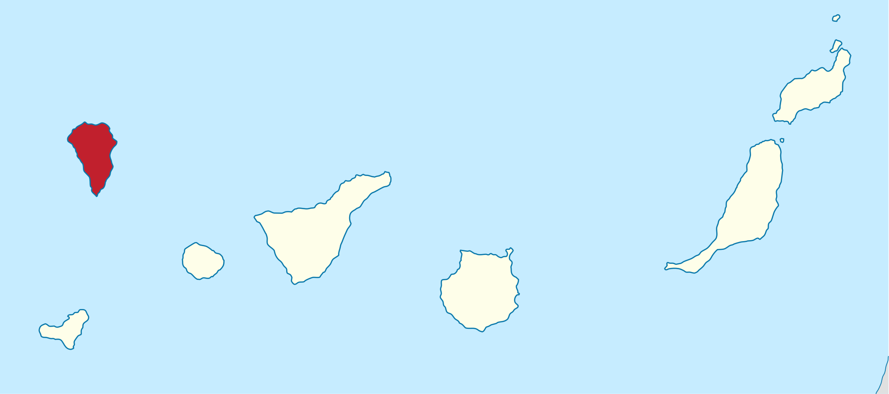

## Introduction

```{r setup}
library(identidrift)
library(tidyverse)
library(PAMpal)
```

```{r}
#| label: fig-test
#| fig-cap: A test figure showing a histogram of Kogia peak frequencies
#| fig-alt: Kogia sima histogram of click peaks
#| fig-height: 1.5
#| fig-width: 6
ks <- getClickData(ks_mtc)
ggplot(ks) + geom_histogram(aes(x=peak))
```

Kogia sima mean peak frequency is `r mean(ks$peak)` (@fig-test).

Data and methods are discussed in @sec-data-methods.

<!-- Let $x$ denote the number of eruptions in a year. Then, $x$ can be modeled by a Poisson distribution -->

<!-- $$ -->
<!-- p(x) = \frac{e^{-\lambda} \lambda^{x}}{x !} -->
<!-- $$ {#eq-poisson} -->

<!-- where $\lambda$ is the rate of eruptions per year. Using @eq-poisson, the probability of an eruption in the next $t$ years can be calculated. -->

<!-- | Name                | Year | -->
<!-- |---------------------|------| -->
<!-- | Current             | 2021 | -->
<!-- | Teneguía            | 1971 | -->
<!-- | Nambroque           | 1949 | -->
<!-- | El Charco           | 1712 | -->
<!-- | Volcán San Antonio  | 1677 | -->
<!-- | Volcán San Martin   | 1646 | -->
<!-- | Tajuya near El Paso | 1585 | -->
<!-- | Montaña Quemada     | 1492 | -->

<!-- : Recent historic eruptions on La Palma {#tbl-history} -->

<!-- @tbl-history summarises the eruptions recorded since the colonization of the islands by Europeans in the late 1400s. -->

<!-- {#fig-map} -->

<!-- La Palma is one of the west most islands in the Volcanic Archipelago of the Canary Islands (@fig-map). -->

<!--  -->

<!-- @fig-spatial-plot shows the location of recent Earthquakes on La Palma. -->

## Data & Methods {#sec-data-methods}

## Conclusion

## References {.unnumbered}

::: {#refs}
:::
